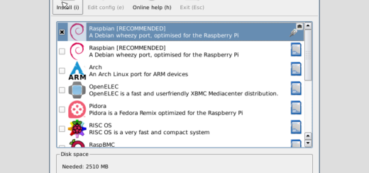
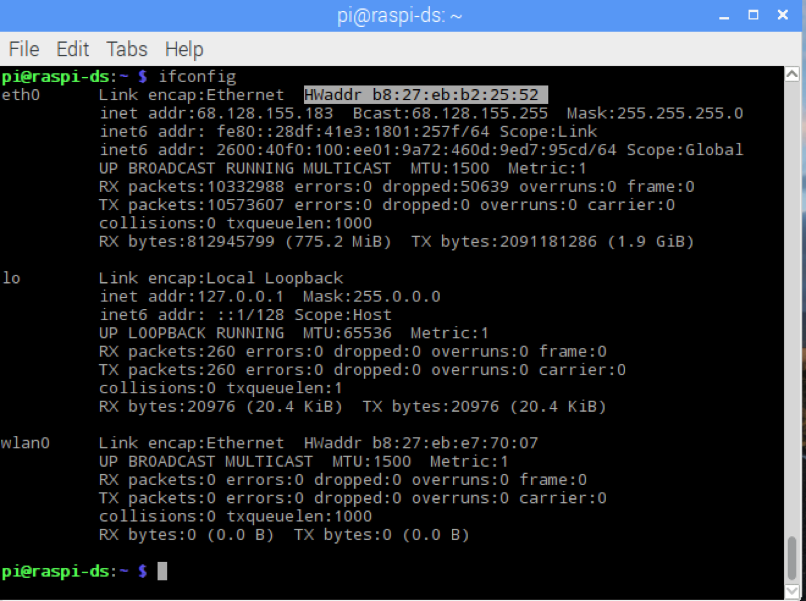
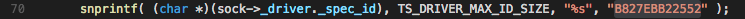

## Raspberry Pi 3 Build Guide
This document serves as a quick start guide to build SDK examples for the Raspberry Pi 3 with Ethernet/WiFi connectivity. Steps mentioned here are not needed if compiling the SDK as a static library.

### Prerequisites

Pi 3 build requires following repositories:

    * https://github.com/verizonlabs/ts_sdk_c
    * https://github.com/verizonlabs/ts_sdk_c_platforms_unix_raspberry-pi3

### Raspberry Pi 3 Preparation


Verify your Raspberry Pi 3 has latest Raspbian version (Version 9 or above):

To determine your Raspberry Pi 3 version, in a terminal window, view os-release file content with command: 

```bash
$ cat /etc/os-release
PRETTY_NAME="Raspbian GNU/Linux 9 (stretch)"
NAME="Raspbian GNU/Linux"
VERSION_ID="9"
VERSION="9 (stretch)"
ID=raspbian
ID_LIKE=debian
HOME_URL="http://www.raspbian.org/"
SUPPORT_URL="http://www.raspbian.org/RaspbianForums"
BUG_REPORT_URL="http://www.raspbian.org/RaspbianBugs"
```

If you don't have the latest version, rebuilt your Raspberry Pi 3 with following steps:

* Make sure your Raspberry Pi 3 is connected to internet via Ethernet cable.
* Restart your Raspberry Pi 3
* While the Raspberry Pi 3 restarting, hold on the "Shift" key, it will bring up the restoration window
* Select the "Raspbian [RECOMMENDED] " (normally the first selection), uncheck others if you have other previous installation.
* Click on the "install" button, the latest Raspbian will be downloaded and installed.



Then, verify the **git** version version, it should be 2.11.0 or above: 

```bash
$ git --version
```

Then, verify the **cmake** version, it should be 3.7.1 or above: 

```bash
$ cmake --version
```

### Download the SDK Code and the Dependencies

Read and follow the README instructions in https://github.com/verizonlabs/ts_sdk_c checkout repository:

```bash
$ git clone https://github.com/verizonlabs/ts_sdk_c.git
$ cd ts_sdk_c
```

### Register Your Device and Prepare Security Certificates

Determine the MAC address of the Raspberry pi:

In a terminal window, run 

```bash
$ ifconfig
```



Regardless you are using Ethernet or WiFi connecting your Raspberry Pi 3 to the internet, identify the MAC address of the Ethernet port of your Raspberry Pi 3 and reformat it properly:
Identify the HWaddr for eth0 on your Raspberry Pi 3. In above screen it is “b8:27:eb:b2:25:52”. Remove the “:” and make all characters in CAP, the proper formatted MAC address for register device in ThingSpace is “B827EBB22552”.

Register the device on to Thingspace portal with above MAC address identified, device type as "ts.device.sdk.themometer" or "ts.device.sdk.packageTracker.legacy", download certificates to root of the repository checkout.

Prepare certificates for the sample application:


```bash
$ ./scripts/include_certs.sh thingspaceserver.pem B827EBB22552.cert.pem B827EBB22552.private.key examples/applications/simple/include/
```

Modify the line 70 of this file to replace the device id with your Mac address:
/ts_sdk_c/examples/platforms/ts_sdk_c_platforms_unix_raspberry-pi3/ts_driver_socket.c



### Build and Run Sample Application

Build ts_sdk and sample applications

```bash
$ cmake . -B./cmake-build-debug -DCMAKE_BUILD_TYPE=Debug -DBUILD_EXAMPLES=ON  
$ cd cmake-build-debug
$ make
```

Note that cmake may ask for your Github username and password multiple times in order to update the Git submodules, or you may setup your git environment with your login information. Note that repositories other than the ones listed above might not be accessible to you.

Above commands will prepare and compile the applications in examples/applications folder and create binary application file in folder: ts_sdk_c/cmake-build-debug/examples/applications

Run applications

Navigate to ts_sdk_c/cmake-build-debug/examples/applications folder (or add file path to your command),run application built above:

```bash
$ ./example_simple
```

While the example_simple application running, activate the device on the development portal and the simulated sensor data should be received and viewable under device history.
